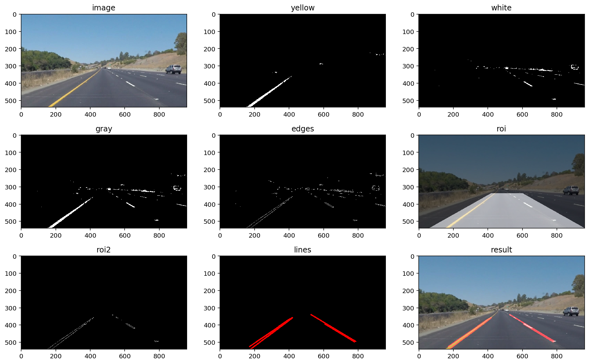
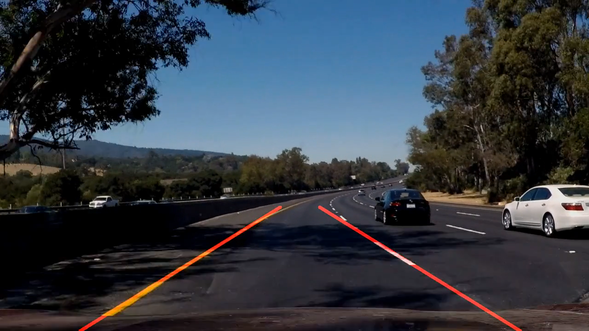
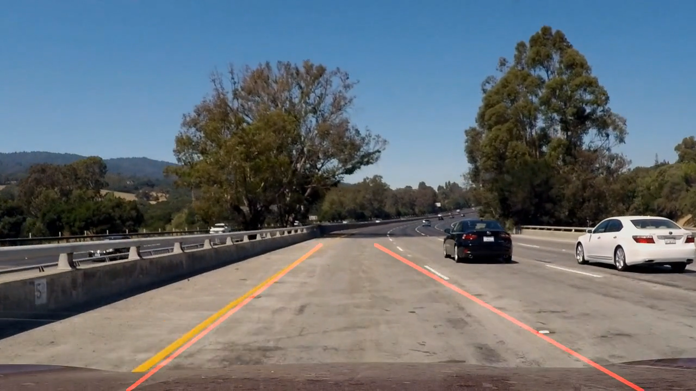

# **Finding Lane Lines on the Road** 

---

**Finding Lane Lines on the Road**

---

### Reflection

### 1. Describe your pipeline. As part of the description, explain how you modified the draw_lines() function.

My pipeline includes the following steps:

1. Converted the image to hsv colorspace
2. Use `cv2.inRange` function find yellow and white color in the image
3. Combine the yellow image and the white image by using `cv2.bitwise_or` function
4. Use Canny algorithm find edges
5. Cut the trapezoidal area from the edges
6. Use Hough transform line detection to detect the lines
7. Draw the lines on a black image and add to original image

In order to draw a single line on the left and right lanes, I modified the draw_lines() function by extend left and right lines and average them with window size of 5.

If you'd like to include images to show how the pipeline works, here is how to include an image: 

### 2. Identify potential shortcomings with your current pipeline

One potential shortcoming would be what would happen when lane line is curve, the top of the line does not match the curve:

Another shortcoming could be that when the vehicle bumps, the average lines may not keep up with changes.

### 3. Suggest possible improvements to your pipeline

A possible improvement would be to use Kalman filter algorithm to predict the lines position.

Another potential improvement could be to use deep learning detect the lines.
