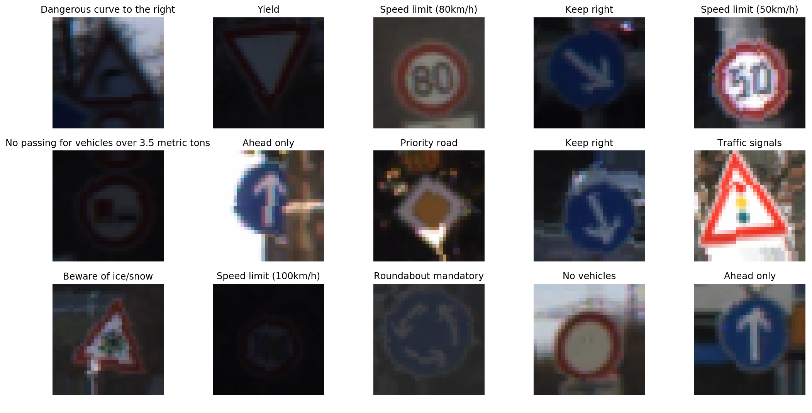
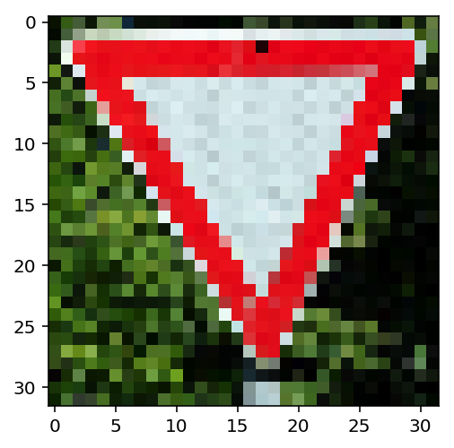

# **Traffic Sign Recognition** 

** Build a Traffic Sign Recognition Project**

The goals / steps of this project are the following:

* Load the data set (see below for links to the project data set)
* Explore, summarize and visualize the data set
* Design, train and test a model architecture
* Use the model to make predictions on new images
* Analyze the softmax probabilities of the new images
* Visualize the activation map of the convolutional output
* Summarize the results with a written report

## Rubric Points

### Here I will consider the [rubric points](https://review.udacity.com/#!/rubrics/481/view) individually and describe how I addressed each point in my implementation.  

----

### Data Set Summary & Exploration

#### 1. Data summary.

I used the pandas library to calculate summary statistics of the traffic signs data set:

* The size of training set is 34799
* The size of the validation set is 4410
* The size of test set is 12630
* The shape of a traffic sign image is (32, 32, 3)
* The number of unique classes/labels in the data set is 43

#### 2. Exploratory visualization of the dataset.

Here is an exploratory visualization of the data set. It is a bar chart showing how the data distribute. We can find the data is unevenly distributed, but the training set, validation set and test set distribution are the same.


### Design and Test a Model Architecture

#### 1. Data preprocess and Data Augmentation

First I normalized the image data because if you do not normalize the image, the training speed may be slow.

```py
X_train = (X_train - 128.0)/128
X_valid = (X_valid - 128.0)/128
X_test = (X_test - 128.0)/128
```

Then I shuffled the image because the raw data is in order, which can affect the training accuracy.

```py
X_train, y_train = shuffle(X_train, y_train)
X_valid, y_valid = shuffle(X_valid, y_valid)
X_test, y_test = shuffle(X_test, y_test)
```

To add more data to the the data set, I made the data augmentation, using the rotation, translation method. Here is an example of an original image and an augmented image:

```py
from keras.preprocessing.image import ImageDataGenerator
datagen = ImageDataGenerator(
        rotation_range=10,  # randomly rotate images in the range (degrees, 0 to 180)
        width_shift_range=0.1,  # randomly shift images horizontally (fraction of total width)
        height_shift_range=0.1,  # randomly shift images vertically (fraction of total height)
        horizontal_flip=False,  # randomly flip images
        vertical_flip=False)  # randomly flip images
datagen.fit(X_train)
```

Before:


After:



For example, we can see the image in the upper right corner has been rotated.

#### 2. Build model structure.

My final model consisted of the following layers:


```py
from keras.layers import *
from keras.models import *
from keras.optimizers import *

inputs = Input(image_shape)
x = inputs

for i in range(3):
    x = Conv2D(32*2**i, 3, padding='same', activation='relu')(x)
    x = Conv2D(32*2**i, 3, padding='same', activation='relu')(x)
    x = MaxPool2D(2)(x)

x = GlobalAveragePooling2D()(x)
x = Dropout(0.5)(x)
x = Dense(n_classes, activation='softmax')(x)

model = Model(inputs, x)
model.compile(loss='sparse_categorical_crossentropy', metrics=['acc'], optimizer='adam')
```

I built this model by repeatedly stacking 2 conv layers and a pooling layer. It refers to the structure of the VGG16 model.

#### 3. Train model.

To train the model, I used an Adam optimizer, because I am not good at turning the learning rate. The code is above. 

Then I set the batch size to 32, trained 30 epochs. I used a ModelCheckpoint callback because model may overfitting, I want to get the bese model.

```py
from keras.callbacks import *

batch_size = 32
epochs = 30
h = model.fit_generator(datagen.flow(X_train, y_train, batch_size=batch_size), 
                        validation_data=(X_valid, y_valid), 
                        callbacks=[ModelCheckpoint('best_model.h5', save_best_only=True)], 
                        steps_per_epoch=n_train//batch_size, epochs=epochs)
```

#### 4. Summary

My final model results were:
* training set accuracy of 0.9913
* validation set accuracy of 0.9871
* test set accuracy of 0.976

Even final training acc is 0.9915, but validation acc is 0.9789, is lower than 0.9871, so I choose the best model. In fact the test acc of 30 epoch model is 0.9718, but the test acc of best model is 0.976.

Here is the acc curve and loss curve:


VGG16 is very successful, but VGG16 is very huge, so I did some changes.

First I used Flatten instead of GlobalAveragePooling2D, then I found that model is very overfitting. Training acc is high but validation acc is lower than now. So I changed it to GlobalAveragePooling2D. And the Dropout layer is very useful. I learned deep learning before, so I add Dropout at first.

Convolution layer is the same as VGG16, 3x3 kernel size, 32, 64, 128 filters, relu activation function. Max pooling is also every 2 conv layers a pooling layer.

I changed the optimizer to sgd, adadelta, but adam is the best optimizer.

Finally, model works well, the training loss and the validation loss is very close, the accuracy also close, so model is not very overfitting but a little. It is normal.

### Test a Model on New Images

#### 1. Choose five German traffic signs found on the web and provide them in the report. For each image, discuss what quality or qualities might be difficult to classify.

Here are five German traffic signs that I found on the web:


The first image might be difficult to classify because around is blank and the traffic sign is in center and there is some distance. The training set does not have a similar image.

#### 2. Discuss the model's predictions on these new traffic signs and compare the results to predicting on the test set. At a minimum, discuss what the predictions were, the accuracy on these new predictions, and compare the accuracy to the accuracy on the test set (OPTIONAL: Discuss the results in more detail as described in the "Stand Out Suggestions" part of the rubric).

Here are the results of the prediction:


The accuracy of the model was 100%. According the 97.6% test accuracy, it is acceptable.

#### 3. How certain the model is written above the traffic sign image. It is almost 100% certainly.

The code for making predictions on my final model is located in the 19th cell of the Jupyter notebook.


For the first image:

```
top5 prediction:
100.00% Stop
0.00% Bicycles crossing
0.00% Speed limit (30km/h)
0.00% No vehicles
0.00% Speed limit (20km/h)
```


For the second image:

```
top5 prediction:
99.43% Speed limit (60km/h)
0.57% Speed limit (20km/h)
0.00% Speed limit (30km/h)
0.00% Speed limit (80km/h)
0.00% Speed limit (50km/h)
```


For the third image:

```
top5 prediction:
100.00% Yield
0.00% Speed limit (20km/h)
0.00% Speed limit (30km/h)
0.00% Speed limit (50km/h)
0.00% Speed limit (60km/h)
```


For the fourth image:

```
top5 prediction:
100.00% Road work
0.00% Speed limit (20km/h)
0.00% Speed limit (30km/h)
0.00% Speed limit (50km/h)
0.00% Speed limit (60km/h)
```


For the fifth image:

```
top5 prediction:
100.00% Keep right
0.00% Speed limit (80km/h)
0.00% Speed limit (100km/h)
0.00% Keep left
0.00% Go straight or right
```

### (Optional) Visualizing the Neural Network 

I visualized the second conv layer's output featuremap.

The raw image for input:



The featuremap of second conv layer:

 

We can see that featuremap 13 and featuremap 23 are activated by the edge of the traffic sign. Featuremap 31 is activated by the traffic sign inside.


