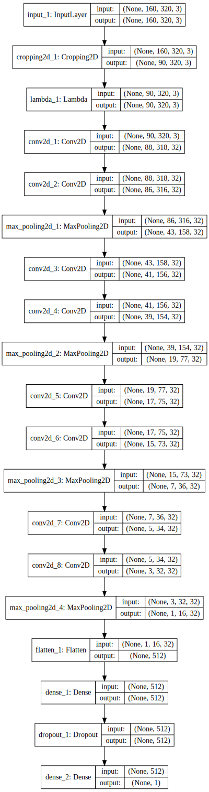
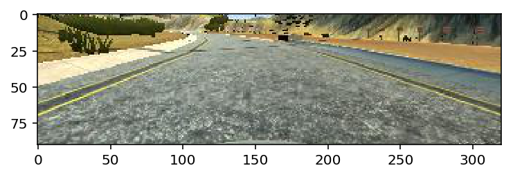
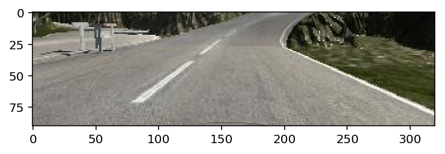

# **Behavioral Cloning** 

---

**Behavioral Cloning Project**

The goals / steps of this project are the following:

* Use the simulator to collect data of good driving behavior
* Build, a convolution neural network in Keras that predicts steering angles from images
* Train and validate the model with a training and validation set
* Test that the model successfully drives around track one without leaving the road
* Summarize the results with a written report

## Rubric Points

### Here I will consider the [rubric points](https://review.udacity.com/#!/rubrics/432/view) individually and describe how I addressed each point in my implementation.  

---

### Files Submitted & Code Quality

#### 1. Submission includes all required files and can be used to run the simulator in autonomous mode

My project includes the following files:
* Scene1.ipynb containing the script to create and train the model for track1
* model1.h5 containing a trained convolution neural network for track1
* Scene2.ipynb containing the script to create and train the model for track2
* model2.h5 containing a trained convolution neural network for track2
* drive.py for driving the car in autonomous mode
* video.mp4 is the record video that the code running on the simulator, including track1 and track2
* P3_report.md summarizing the results

#### 2. Submission includes functional code

Using the Udacity provided simulator and my drive.py file, the car can be driven autonomously around the track by executing 

```sh
python drive.py model1.h5    # model2.h5 if track2
```

#### 3. Submission code is usable and readable

The model.py file contains the code for training and saving the convolution neural network. The file shows the pipeline I used for training and validating the model, and it contains comments to explain how the code works.

### Model Architecture and Training Strategy

#### 1. Model Architecture

My model consists of a convolution neural network with 3x3 filter sizes and depths is always 32. The activation function except for the last layer is tanh, the other layers are relu.

The data is normalized in the model using a Keras lambda layer. The code is very simple:

```py
inputs = Input(X.shape[1:])

x = inputs
x = Cropping2D(((50, 20), (0, 0)))(x)
x = Lambda(lambda x:x/255-0.5)(x)
for i in range(4):
    for j in range(2):
        x = Conv2D(32, 3, activation='relu')(x)
    x = MaxPooling2D(2)(x)

x = Flatten()(x)
x = Dense(512, activation='relu')(x)
x = Dropout(0.2)(x)
x = Dense(1, activation='tanh')(x)

model = Model(inputs, x)
model.compile(loss='mse', optimizer='adam')
```

#### 2. Attempts to reduce overfitting in the model

The model contains dropout layers in order to reduce overfitting (above). 

The model was trained and validated on different data sets to ensure that the model was not overfitting (below). The model was tested by running it through the simulator and ensuring that the vehicle could stay on the track.

```py
model.fit(X, y, batch_size=128, epochs=10, validation_split=0.2)
```

#### 3. Model parameter tuning

The model used an adam optimizer, so the learning rate was not tuned manually (above).

#### 4. Appropriate training data

We need to accomplish two tasks, one is to complete the track, the other is to keep the lane line. So when I recorded the data, not only to ensure to complete the track, but also to drive very dangerously.

For details about how I created the training data, see the next section. 

### Model Architecture and Training Strategy

#### 1. Solution Design Approach

The overall strategy for deriving a model architecture was to add many convolutional and pooled layers to reduction  dimension and then use the dense layer to regress the steering wheel.

My first step was to use a convolution neural network model similar to the VGG16, I made some changes because VGG16 is very huge and very easy to get a  overfitting model.

Because of the experience of the previous project, I easily got a fitting model for this project. Then I tested my model on simulator.

The model works well on track1, so I saved the model.

At the end of the process, the vehicle is able to drive autonomously around the track without leaving the road.

#### 2. Final Model Architecture

The final model code is above. Here is a visualization of the architecture:



#### 3. Creation of the Training Set & Training Process

Because of my well driving performance, my model works very well. 

My driving skill is to first ensure that the track is completed and then drive as far as possible to the edge of the track, both to ensure that the track is completed and to return to the center when yawing. 

Here is another skill, when I encounter a corner, I try to turn the steering wheel as far as I can, and then adjust the direction of the car, so that the model does not turn too late.

Then I repeated this process on track two in order to get more data points. Finally, I recorded 7k images in track1 and 15k images in track2.

To augment the data sat, I also flipped images and angles thinking that this would make the model more robust. Here is the code:

```py
X = np.concatenate([X, X[:,::-1]], axis=0)
y = np.concatenate([y, -y], axis=0)
```

After the collection process, I had 4139 number of data points.

I finally randomly shuffled the data set and put 20% of the data into a validation set. 

```py
from sklearn.utils import shuffle

X, y = shuffle(X, y)
```

```py
model.fit(X, y, batch_size=128, epochs=10, validation_split=0.2)
```

There is a Cropping2D layer in model because the scene is not useful, and may influent the model. Instead of letting the model learn to ignore, it is better to cut it directly.

```py
x = Cropping2D(((50, 20), (0, 0)))(x)
```

Here is example of the cropped image:





The only preprocessing step is normalization:

```py
x = Lambda(lambda x:x/255-0.5)(x)
```

I used this training data for training the model. The validation set helped determine if the model was over or under fitting. The ideal number of epochs was 10 as evidenced by validation loss last 5 epochs did not decline. I used an adam optimizer so that manually training the learning rate wasn't necessary.

#### 4. Record video

In order to record high-definition and high fps videos, I used OBS software.

Then I used iMovie to speed up the video, and add a music, Paint It Black. It is used in Tesla video before.

Here is YouTube link: [https://www.youtube.com/watch?v=vO8fwJ7KxvI](https://www.youtube.com/watch?v=vO8fwJ7KxvI)
